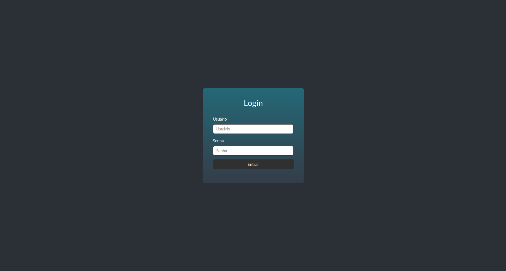
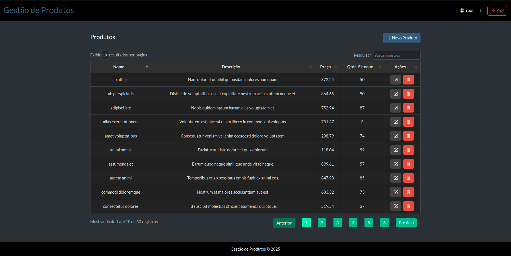
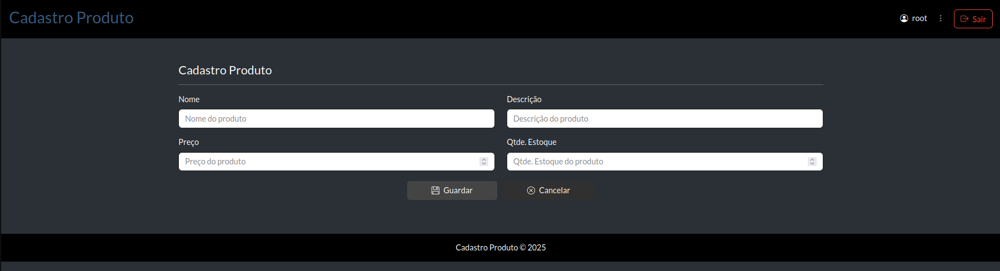
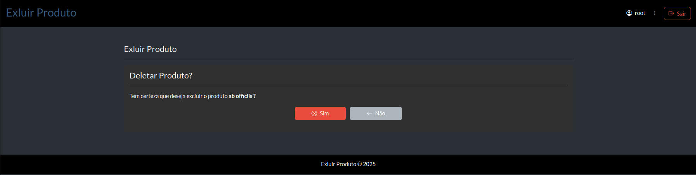
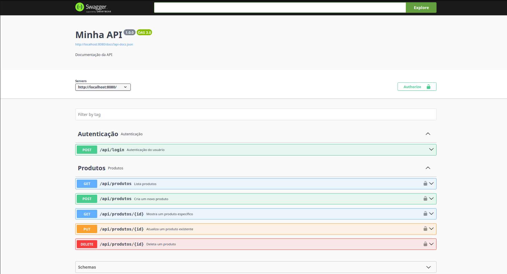

# 📦 API de Produtos Laravel + Docker

Este é um projeto de API RESTful desenvolvido em Laravel, utilizando Docker. A aplicação consiste em um sistema de gerenciamento de produtos com funcionalidades de cadastro, listagem, edição e exclusão.

## 🚀 Tecnologias Utilizadas

-   PHP 8.x
-   Laravel 10.x
-   PostgreSQL
-   Docker
-   Docker Compose

## 📁 Estrutura do Projeto

```bash
├── app/                   # Código fonte Laravel
├── docker-compose.yml     # Define os serviços (app, db, etc)
├── Dockerfile             # Configura a imagem do app Laravel
└── README.md
```

--

## 📸 Demonstrações

> Abaixo algumas telas da aplicação:

### 🔑 Tela de Login



### 📋 Listagem de Produtos



### ➕ Cadastro de Produto



### ❌ Deletar Produto



### 📃 Documentação API (Swagger)



---

## ⚙️ Pré-requisitos (Instalação)

-   Clique ⬇️
-   [Docker](https://docs.docker.com/get-started/get-docker/)
-   [Docker-compose](https://docs.docker.com/compose/install/)

## 💻 Como Rodar o Projeto

1. Clonar o repositório

```bash
git clone https://github.com/seu-usuario/seu-repo.git
cd seu-repo
```

2. Copiar o .env

```bash
cp .env.example .env
```

-   Edite as configurações de banco no .env conforme o serviço do docker-compose

```bash
DB_CONNECTION=pgsql
DB_HOST=db
DB_PORT=5432
DB_DATABASE=db_produtos
DB_USERNAME=root
DB_PASSWORD=1234
```

3. Subir os containers

```bash
docker-compose up -d --build
```

Isso irá:

-   Subir o container da aplicação Laravel
-   Subir o container do PostgreSQL

4. Instalar as dependências

```bash
docker exec -it produtos-app composer install
```

5. Gerar a key do Laravel

```bash
docker exec -it produtos-app php artisan key:generate
```

## 🔐 Configurando Autenticação JWT

Caso sua API use autenticação por JWT, siga os passos abaixo:

1. Instalar o pacote:

```bash
docker exec -it produtos-app composer require tymon/jwt-auth
```

2. Publicar o provider do JWT:

```bash
docker exec -it produtos-app php artisan vendor:publish --provider="Tymon\JWTAuth\Providers\LaravelServiceProvider"
```

3. Gerar a chave JWT:

```bash
docker exec -it produtos-app php artisan jwt:secret
```

4. Atualizar o arquivo config/auth.php, definindo o guard api com:

```bash
'guards' => [
    'api' => [
        'driver' => 'jwt',
        'provider' => 'users',
    ],
],
```

5. Corrigir permissões (importante em ambientes Docker/Linux):

```bash
docker exec -it produtos-app chown -R www-data:www-data storage bootstrap/cache
docker exec -it produtos-app chmod -R 777 storage bootstrap/cache

docker exec -it produtos-app -R www-data:www-data storage/api-docs
docker exec -it produtos-app chmod -R 775 storage/api-docs
```

6. Rodar as migrations e seeders:

```bash
docker exec -it produtos-app php artisan migrate --seed
```

7. banco de dados

```bash
docker exec -it produtos-db bash psql -U root -d db_produtos
```

## 🌐 Acesso à API

A aplicação estará disponível em:

```bash
http://localhost:8080
```

Documentação Swagger (API)

```bash
http://localhost:8080/api/documentation
```

Ver logs do app

```bash
docker-compose logs -f produtos-app
```

Acessar o container da aplicação

```bash
docker exec -it produtos-app bash
```

Parar os containers

```bash
docker-compose down
```

## 🧪 Testes Automatizados (PHPUnit)

Para rodar os testes automatizados (unitários e de feature) dentro do container Laravel, use:

```bash
docker exec -it produtos-app php artisan test
```

## ✅ Endpoints (Exemplos)

-   GET (/api/produtos) => Listar todos os produtos
-   GET (/api/produtos/{id}) => Buscar um produto pelo nome
-   POST (/api/produtos) => Criar um novo produto
-   PUT (/api/produtos/{id}) => Atualizar um produto

## 👨‍💻 Autor

-   Nome: Luan Amaral
-   LinkedIn: [linkedin.com/in/luan-kleber-amaral](https://www.linkedin.com/in/luan-kleber-amaral-0b2abb187/)
-   Email: luanamaral.6540@hotmail.com
